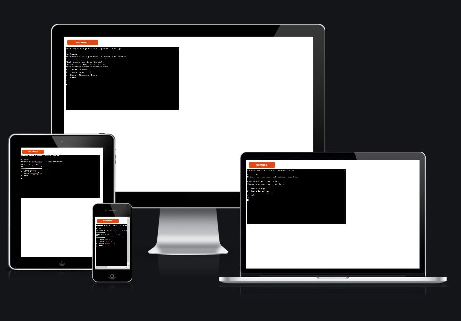

# Kitchen-Assistant
[View the live project here](https://kitchen-assistant-program.herokuapp.com/)

## Application Objectives
The Kitchen Assistant is an app to help an individual plan out their meal by sharing easy food recipes, while also maintaining a record of available items in the inventory. The app does not only help maintain that, it also helps the user to create a shopping list and adds items to it according to the shortage of ingredients required for any particular recipe.
Using this app is very easy and convinient. A user can quickly and effortlessly view what all recipes are available in the system and choose any according to their liking. They can also view the items in the inventory and can manually add more items or change the amount of the available items.
The app also displays the shopping list, and provides the user with the option to add/remove items to it.

# Table of Content
 -  [UX/UI](#ux)
    - [User Demographic](#demographic)
    - [User Stories](#stories)
    - [Process Flow](#flow)
 - [Features](#features)
    - [Present Features](#present)
        1. [Check Recipe](#recipe)
        1. [Check Inventory](#inventory)
        1. [Check Shopping List](#shopping-list)
            - [Add Items](#add)
            - [Remove Items](#remove)
            - [Clear List](#clear)
    - [Future Features](#future)
 - [Technologies and Libraries Used](#tech)
    1. [Main Language Used](#language)
    1. [Python Library and API used](#api)
    1. [Data Storage](#storage)
 - [Testing and Bug Fixes](#testing)
 - [Development and Deployment](#deployment)
 - [Credits and Acknowledgement](#credits)

# UX/UI 

 ## User Demographic: 
  - The Kitchen-Assitant app is targeted towards anyone who wants to have an organised kitchen, with all their recipes saved at one location and easily accessible with the ease of knowing what ingredients are available to cook.
 
 ## User Stories:
  - ### First Time User:
    1. As a first time user, I want to easily understand the functioning of the application without getting confused with any of the features.
    1. As a first time user, I want to easily navigate throughout the app without getting overwhelmed by any of the features.
    1. As a first time user, I want the instructions to be clear and precise.

 ## Process Flow Chart: 
  