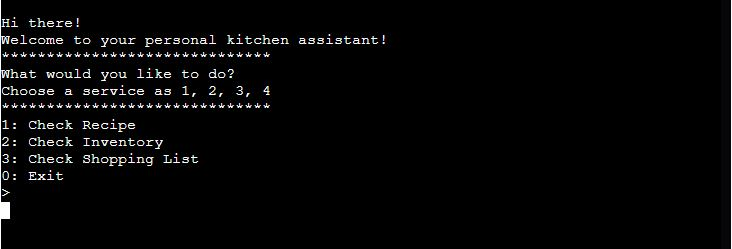
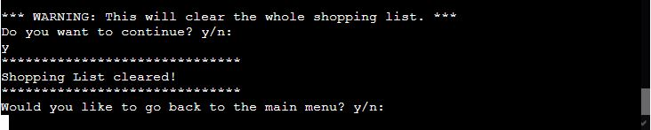

# Kitchen-Assistant
[View the live project here](https://kitchen-assistant-program.herokuapp.com/)

## Application Objectives
The Kitchen Assistant is an app to help an individual plan out their meal by sharing easy food recipes, while also maintaining a record of available items in the inventory. The app does not only help maintain that, it also helps the user to create a shopping list and adds items to it according to the shortage of ingredients required for any particular recipe.
Using this app is very easy and convinient. A user can quickly and effortlessly view what all recipes are available in the system and choose any according to their liking. They can also view the items in the inventory and can manually add more items or change the amount of the available items.
The app also displays the shopping list, and provides the user with the option to add/remove items to it.

## Table of Content
 -  [UX/UI](#ux)
    - [User Demographic](#demographic)
    - [User Stories](#stories)
    - [Process Flow](#flow)
 - [Features](#features)
    - [Present Features](#present)
        1. [Check Recipe](#recipe)
        1. [Check Inventory](#inventory)
        1. [Check Shopping List](#shopping-list)
            - [Add Items](#add)
            - [Remove Items](#remove)
            - [Clear List](#clear)
    - [Future Features](#future)
 - [Technologies and Libraries Used](#tech)
    1. [Main Language Used](#language)
    1. [Python Library and API used](#api)
    1. [Data Storage](#storage)
 - [Testing and Bug Fixes](#testing)
 - [Development and Deployment](#deployment)
 - [Credits and Acknowledgement](#credits)

## UX/UI 

 ### User Demographic: 
  - The Kitchen-Assitant app is targeted towards anyone who wants to have an organised kitchen, with all their recipes saved at one location and easily accessible with the ease of knowing what ingredients are available to cook.
 
 ### User Stories:
  - ### First Time User:
    1. As a first time user, I want to easily understand the functioning of the application without getting confused with any of the features.
    1. As a first time user, I want to easily navigate throughout the app without getting overwhelmed by any of the features.
    1. As a first time user, I want the instructions to be clear and precise.

  - ### Regular/Frequent User:
    1. As a regular user, I want to be able to organise my kitchen easily and without any hassle.
    1. As a regular user, I want to have the precise knowledge of where to go to achieve a particular task.
    1. As a regular user, I want the app to run smoothly without any bugs or issues.

 ### Process Flow Chart: 
  

## Features 

### Present Features 
  - The main menu displays the three basic services provided by the Kitchen-Assistant App:
    - Check Recipe
    - Check Inventory
    - Check Shopping List
  - A user can select any of the services by typing the number 1,2,3 etc. This will take them to the feature.

    

  - Check Recipe: 
    1. When a user selects “Check Recipe” feature, the app displays the name of all the available recipes.
    1. The app then asks the user whether they would like to cook today.
    1. If the user says yes, (by typing “y”), the app then ask the user what they would like to cook, and the user can select any recipe of their choice by typing in the name of the recipe, for eg. Creamy Pasta.
    1. The app then checks the amount of the ingredient required and compares them against the ingredient amount available in the inventory.
    1. If all ingredients are available in required amount, the app then displays the steps required to cook the food.
    1. In case all ingredients are not available, it gives a message saying “Not all ingredients available” and also adds the items and amount to the shopping list for the user’s convenience.
    1. For demonstration purpose, couple of ingredients for Butter Chicken is not available and can be tested for the app’s response to it.
    1. If the user chose “no” when asked to cook, or once the steps are displayed, the app then asks the user whether they would like to go back to the main menu.
    1. The user can opt to go back to the main menu by pressing “y” or can exit the app by pressing “n”.
      
    
      
    
      
    
      

  - Check Inventory: 
    1. When the user selects “Check Inventory” feature, the app checks the google sheet and displays all the items in the inventory and the amount available.
    1. The app then asks the user whether they would like to make any changes to it. The user can either opt to do so or not by pressing “y” or “n”.
    1. If the user chooses to edit the inventory, the app will display the instruction on how to add/edit an item.
    1. Whenever the user enters an item and amount, the app checks the inventory if the item is already there.
    1. If the item is already in the inventory, the app changes the amount available to the new amount entered by the user and shows the message “Updated!”
    1. In case the item is not in the inventory, the app adds the new item with the amount entered by the user and displays the message “Added!”
    1. Once done, the user can exit the edit mode by pressing “0” and enter.
    1. The app would then ask whether the user would like to go back to the main menu.
    1. The user can opt to go back to the main menu by pressing “y” or can exit the app by pressing “n”.
      
    
      
    
      

  - Check Shopping List: 
    1. When the user selects “Check Shopping List” feature, the app checks the google sheet and displays all the items added to the shopping list tab.
      
    
      
    1. The app then provides four options to the user:
        - Add Items: 
            1. The app lets the user to add new items to the shopping list.
            1. When selected, the app displays the instruction on how to add new items and prompts the user to add the item’s name and amount.
            1. Once added, the app then asks whether the user wants to continue.
            1. The user can exit this mode by either pressing “n” when prompted or by pressing “0” when prompted to add item’s name.
              
            
              
        - Remove Items: 
            1. The app lets the user to remove any item from the shopping list.
            1. When selected, the app first checks the shopping list. If there are no items on the list, it displays the message “No items found to remove”
            1. If there are items on the list, it shows a warning and prompts the user to type in the name of the item to be removed.
            1. Once removed, the app then asks the user whether they would like to continue.
            1. The user can exit this mode by either pressing “n” when prompted or by pressing “0” when asked which item to remove.
              
            
              
        - Clear List: 
            1. The app lets the user to clear the whole shopping list at once.
            1. When selected, the app displays a warning that this would clear the whole list and asks the user if they would like to continue with this.
            1. If the user selected “y”, the app clears the whole shopping list.
              
            
              
    1. Once the user exits any of the modes, the app then asks the user whether they would like to go back to the main menu.
    1. The user can opt to go back to the main menu by pressing “y” or can exit the app by pressing “n”.

### Future Features 
  - Allow users to add new recipes and ingredient requirements.
  - Automatic reduction of item amount from inventory depending on the user’s choice of recipe.

## Technologies and Libraries Used 
  - ### Main Languages: 
    1. [Python](https://en.wikipedia.org/wiki/Python_(programming_language))
    2. [HTML](https://en.wikipedia.org/wiki/HTML)- Available as a part of CodeInstitute template.
    3. [CSS](https://en.wikipedia.org/wiki/CSS)- Available as a part of CodeInstitute template.
    4. [JavaScript](https://en.wikipedia.org/wiki/JavaScript)- Available as a part of CodeInstitute template.

  - ### Python Libraries and APIs used: 
    1. [Google-Auth](https://google-auth.readthedocs.io/en/master/index.html)
    1. [Gspread](https://docs.gspread.org/en/v5.3.2/)
  
  - ### Data Storage 
    - The recipes, inventory and shopping list are fetched and stored on Google Sheet via:
        1. [Google Drive API](https://developers.google.com/drive/api)
        1. [Google Sheet API](https://developers.google.com/sheets/api)

## Testing and Bug Fixes 
  - The application is thoroughly tested with different valid and invalid inputs and continuous loops to find bugs and crashes.
  - Initially, some of the loops weren’t working as intended and would not break. This was solved through testing.
  - There were also minor input error issues which was resolved.

  - ## Validator Testing
    - The code has also been tested and verified via [PEP8 Online](http://pep8online.com/). No issues were found other than few lines that were too long, and were fixed.

  - ## Unfixed Bugs
    - No known bugs at this point.

## Development and Deployment 
The development environment used for this project was GitPod. To track the development stage and handle version control regular commits and pushes to GitHub has been conducted. The GitPod environment was created using a template provided by Code Institute.
The live version of the project is deployed using [Heroku](https://heroku.com)
The steps taken to deploy the project via Heroku are as follows:
  - To prepare for deployment on Heroku a requirements.txt needs to be created in the same folder as the .py file in GitPod. This file needs to contain a list of all libraries the project needs to run as a Heroku App.
  - Then follow these steps:
    1. Login to Heroku (Create an account if necessary)
    1. Click on New in the Heroku dashboard and select ”Create new app”
    1. Write a name for the app and choose your region and click ”Create App”
    1. In the settings tab for the new application create two Config vars. 
        - One is named CREDS and contains the credentials key for Google Drive API.
        - One is name PORT and has the value of 8000.
    1. Two buildpack scripts were added: Python and Nodejs (in that order)
  - Heroku CLI was used to deploy the project. The following steps were taken in the terminal of GitPod
    1. Login to heroku and enter your details.
        - command: heroku login -i
    1. Get your app name from heroku.
        - command: heroku apps
    1. Set the heroku remote. (Replace app_name with your actual app name)
        - command: heroku git:remote -a app_name
    1. Add, commit and push to github
        - command: git add . && git commit -m "Deploy to Heroku via CLI"
    1. Push to both github and heroku
        - command: git push origin main
        - command: git push heroku main

## Credits and Acknowledgement 
  - ### Credits:
    - [Visme](https://www.visme.co/flowchart-maker/) was used to create the flowchart for the process flow.
    - [Heroku](https://heroku.com) was used to deploy the app.
    - [Gspread](https://docs.gspread.org/en/v5.3.2/) website was used to find various methods to store and fetch data to and from the google sheet using python.
    - [Am I Responsive](https://ui.dev/amiresponsive) was used to check the various screen compatibilities.
  - ### Content:
    - All the contents of the app was written by the developer.
  - ### Acknowledgement:
    - Code institute for the deployment terminal
    - My Mentor, Martina Terlevic, for her continuous helpful feedback.
    - Tutor support at Code Institute for their support.
